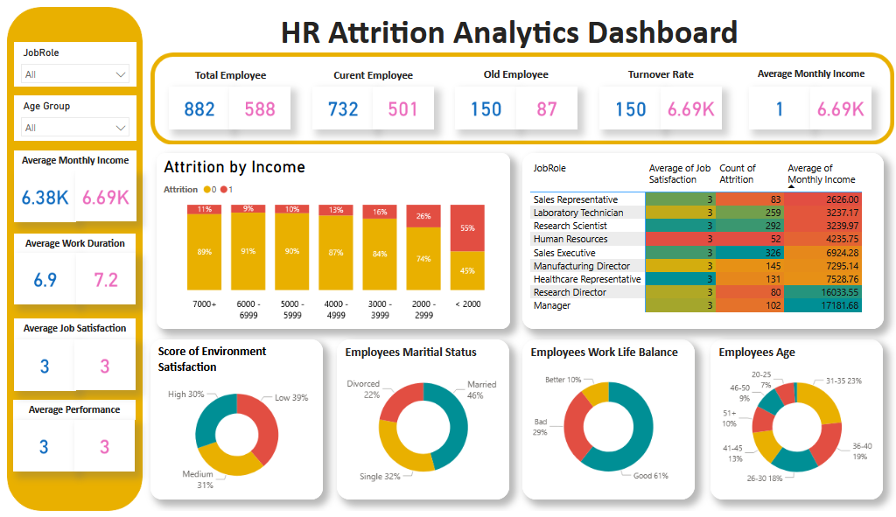

HR Attrition Analisis 📊

Proyek ini bertujuan untuk menganalisis data HR (Human Resources) dengan tema attrition/penyebab resign karyawan.  
Tujuannya menemukan pola antar variabel seperti job role, work-life balance, environment satisfaction, 
dan faktor-faktor lain yang memengaruhi tingkat keluar-masuk karyawan.
Contoh tampilan dashboard analisis HR:

🔹 Tools yang Digunakan
- Python (with library Pandas, NumPy, Matplotlib, Seaborn)
- SQL / MySQL
- Excel (Data Cleaning, dan Formula Statistik)
- Power BI (Dashboard Interaktif)
- Jupyter Notebook (Exploratory Data Analysis & Data Visualization)

 🔹 Fitur Analisis
- Analisis Attrition (faktor penyebab karyawan keluar, yes=1(resign), no=0(not resign))
- Visualisasi data (grafik & dashboard)
- Perbandingan berdasarkan:
  - Gender
  - Age
  - Department
  - Job Role
  - Education Field
  - Work Life Balance
  - Monthly Income
  - Job Satisfaction
  - Environment Satisfaction

 🔹 Struktur Project
 - Dataset HR Karyawan (1470 baris)
 - Data Cleaning & Statistik dengan Excel
 - Analisis dengan Jupyter Notebook
 - Dashboard dengan Power BI
 - Presentasi projek (pdf)
 - Screenshot dan Video dashboard HR

   
 🔹 Cara Menjalankan
1. Clone repo:
   ```bash
   git clone https://github.com/nabilahlw/HR_Analisis.git
   cd HR_Analisis
pip install -r requirements.txt
jupyter notebook


